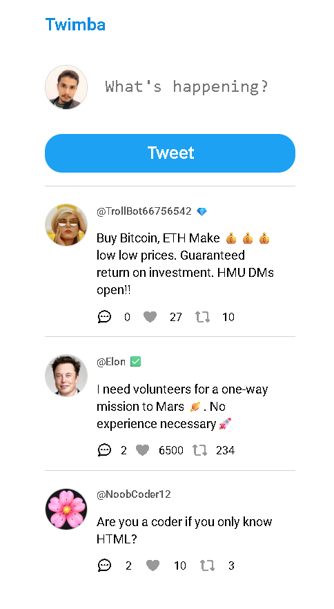
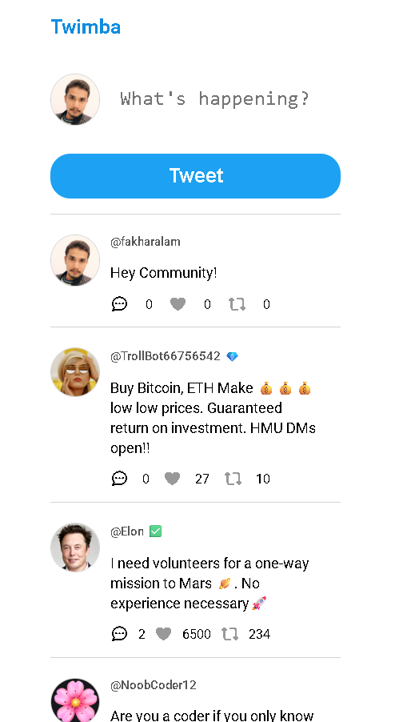
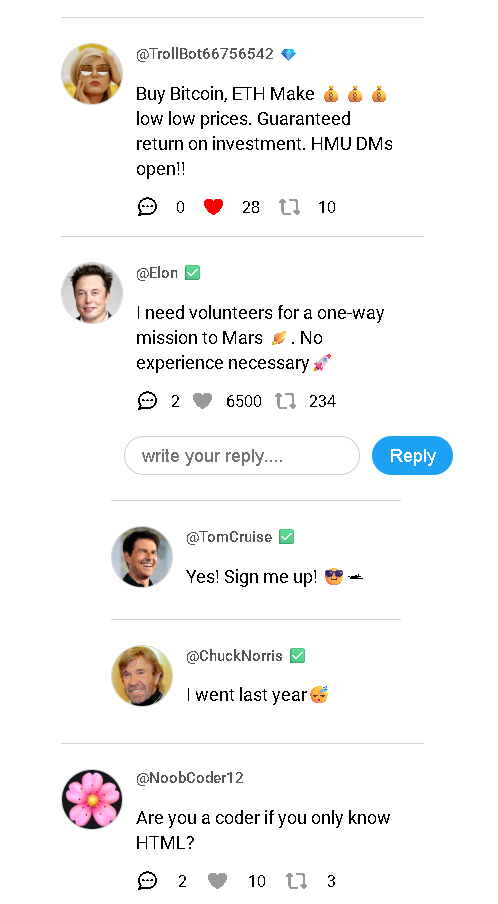
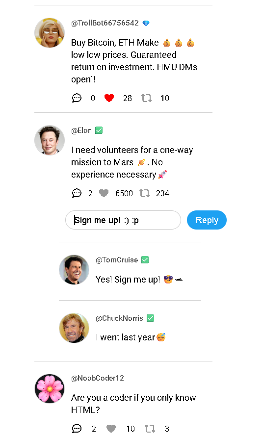
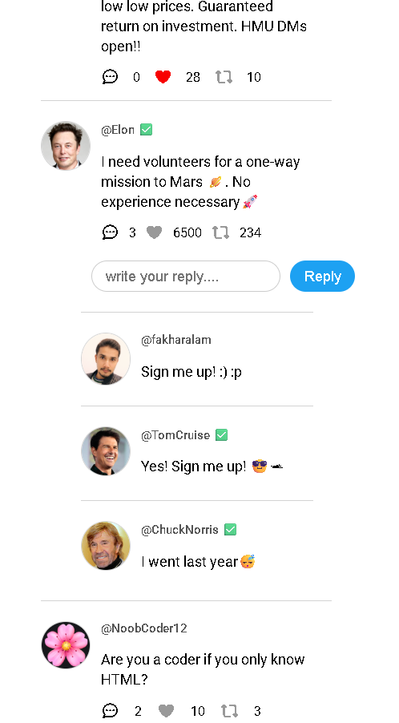

#  Old Twitter Clone (Vanilla JavaScript)

A simplified **classic Twitter-style feed** built using **Vanilla JavaScript**, inspired by early Twitter. Users can post tweets, like, retweet, and reply — with data persisted using **localStorage**.

---

## 📂 GitHub Repository

🔗 [https://github.com/ThisisAlam](https://github.com/ThisisAlam)

---

## ✨ Features

* 📝 Post new tweets
* ❤️ Like / Unlike tweets
* 🔁 Retweet functionality
* 💬 Reply to tweets
* 📊 Live counters (likes, retweets, replies)
* 💾 Persistent data using localStorage
* ⚡ Instant UI updates without page reload

---

## 🧠 What I Learned

* Event delegation for dynamic UI
* Data-driven rendering (state → UI)
* Managing state in JavaScript
* Using localStorage for persistence
* Core DOM manipulation

---

## 🛠️ Tech Stack

* HTML
* CSS
* JavaScript (Vanilla JS)
* localStorage API

---

## 📸 Screenshots

### 🏠 Feed UI

### ✍️ Posting a Tweet

### ❤️ Like Interaction

### 💬 Reply Section Open

### 🗨️ Reply Added

---

## ⚠️ Challenges

* Handling re-rendering without breaking UI
* Managing dynamic IDs and event delegation
* Keeping UI and data in sync

---

## 💡 Future Improvements

* Keep reply section open after submitting
* Add delete/edit tweet
* Improve UI/animations
* Migrate to React

---

## 🙌 Acknowledgment

This project is part of my learning journey with **Scrimba**.

👉 Learn coding interactively:
[https://scrimba.com/?via=u43a7734](https://scrimba.com/?via=u43a7734)

---

## 🔗 Connect with Me

* LinkedIn: [https://www.linkedin.com/in/fakhar-e-alam-a046133b4/](https://www.linkedin.com/in/fakhar-e-alam-a046133b4/)
* GitHub: [https://github.com/ThisisAlam](https://github.com/ThisisAlam)

---

## 🏁 Final Thoughts

This project helped me move from static pages to building a **fully interactive, state-driven application**, similar to early social media platforms.

---
